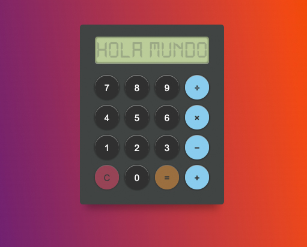
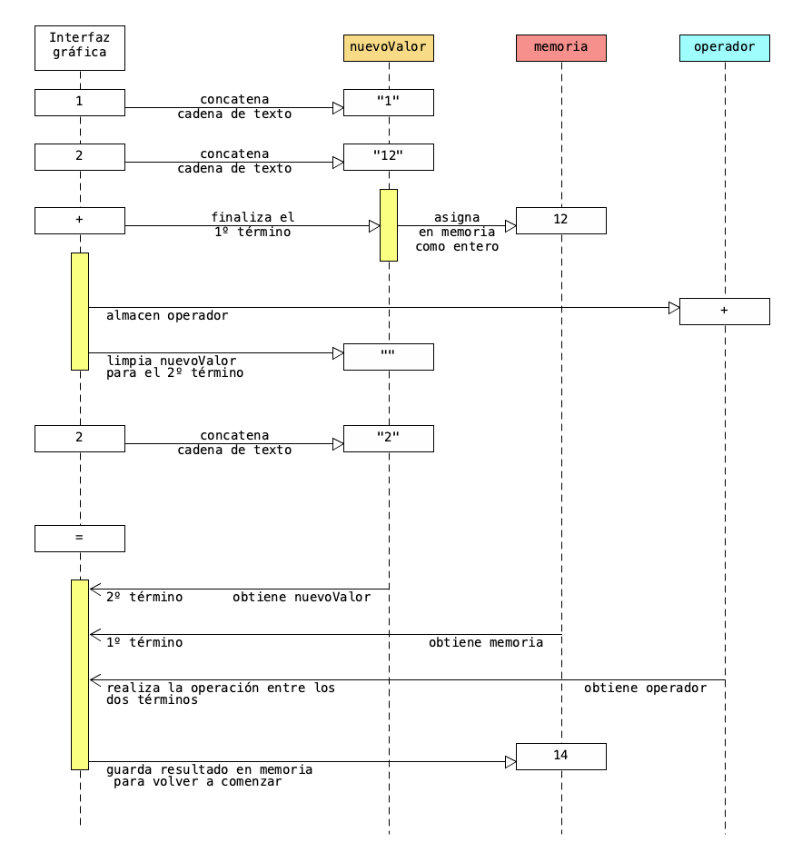

# Calculadora Simple
Este proyecto tiene como objetivo didáctico, fomentar la práctica de la interacción entre JavaScript y los elementos del DOM.  

La estrategia es sencilla, capturar los botones numéricos, acumular el valor actual para luego guardarlo en memoria una vez seleccionemos un operador matemático.

El código está comentado y se encuentra dentro de la carpeta [proyecto](https://github.com/gonzalocastilloar/calculadora/tree/main/proyecto).

---
### Diagrama secuencial del proceso de variables en memoria.

---

Si tienes alguna duda, sugerencia o simplemente te gustó, puedes escribirme a gonzalocastilloar@gmail.com.

Que lo disfrutes! :D

